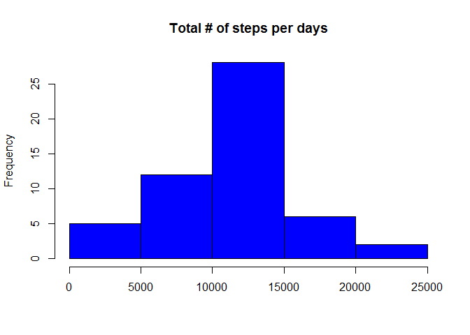
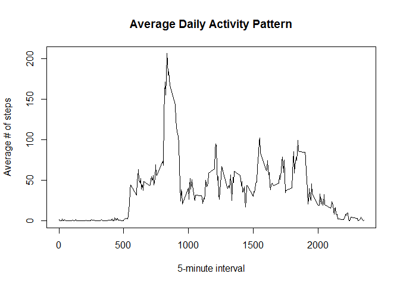
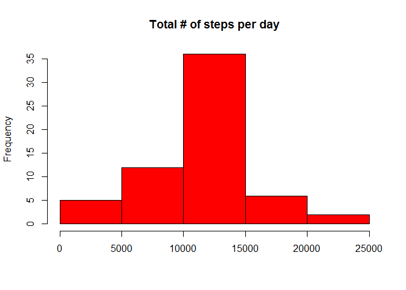
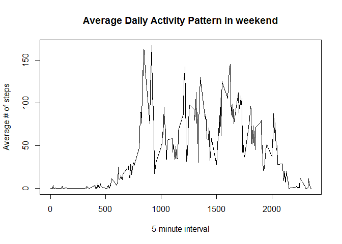
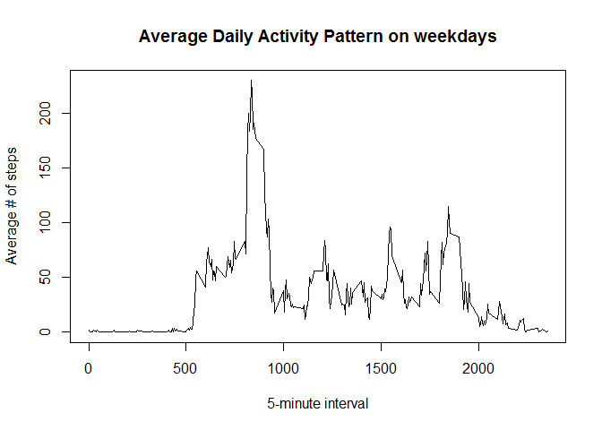

# Reproducible Research: Peer Assessment 1


## Loading and preprocessing the data


```r
file <- unzip("activity.zip")
dataset <- read.csv(file,sep = ",", header = TRUE, stringsAsFactors = FALSE)
data <- dataset[which(!is.na(dataset$steps)),]
```


## What is mean total number of steps taken per day?

```r
nrsteps <-tapply(data$steps, data$date, sum)

#Show histogram
hist(nrsteps, main ="Total # of steps per days", xlab = "", col="blue")
```

 

```r
# What is the mean total number of steps taken per day?
mean(nrsteps)
```

```
## [1] 10766.19
```

```r
# What is the median total number of steps taken per day?
median(nrsteps)
```

```
## [1] 10765
```

## What is the average daily activity pattern?

```r
#What is the average daily activity pattern?
dailysteps <-tapply(data$steps, data$interval, mean)

#Show plot
plot(y = dailysteps,x = names(dailysteps), type = "l", xlab = "5-minute interval", 
     main = "Average Daily Activity Pattern", ylab = "Average # of steps")
```

 

```r
#What is the maximum amount?
max(dailysteps)
```

```
## [1] 206.1698
```

```r
#What is the corresponding interval?
dailysteps[dailysteps == max(dailysteps)]
```

```
##      835 
## 206.1698
```

## Imputing missing values

```r
#Inputting missing values
data <- dataset
data[which(is.na(data$steps)),1] <- dailysteps[as.character(data[which(is.na(data$steps)),3])]
dailysteps_new<-tapply(data$steps, data$date, sum)

#Show new histogram
hist(dailysteps_new, main = "Total # of steps per day", xlab = "",col="red")
```

 

```r
#Calculating new mean and median
mean(dailysteps_new)
```

```
## [1] 10766.19
```

```r
median(dailysteps_new)
```

```
## [1] 10766.19
```

```r
#Do the values differ from before? What is the impact?
mean(nrsteps)-mean(dailysteps_new)
```

```
## [1] 0
```

```r
median(nrsteps)-median(dailysteps_new)
```

```
## [1] -1.188679
```

As can be seen, the impact on the mean and median is relatively small.


```r
## Are there differences in activity patterns between weekdays and weekends?
#Convert dates to date format
data$date <- as.Date(data$date)

#Use weekdays function
data$weekday <- weekdays(data$date)

#Add typeofday 
dayType <- function(dates) {
  f <- function(date) {
    if (weekdays(date) %in% c("zaterdag", "zondag")) {
      "weekend"
    }
    else {
      "weekday"
    }
  }
  sapply(dates, f)
}

data$typeofday <- as.factor(dayType(data$date))


#Creating subsets of data
data_weekend <- subset(data, typeofday == "weekend")
data_weekday <- subset(data, typeofday == "weekday")

#Calculate new daily steps per weekend and weekday
dailysteps_weekend <- tapply(data_weekend$steps, data_weekend$interval, mean)
dailysteps_weekday <- tapply(data_weekday$steps, data_weekday$interval, mean)

#Make plot for weekend
plot(y = dailysteps_weekend, x = names(dailysteps_weekend), type = "l", xlab = "5-minute interval", 
     main = "Average Daily Activity Pattern in weekend", ylab = "Average # of steps")
```

 

```r
#Make plot for weekday
plot(y = dailysteps_weekday,x = names(dailysteps_weekday), type = "l", xlab = "5-minute interval", 
     main = "Average Daily Activity Pattern on weekdays", ylab = "Average # of steps")
```

 

As can be seen in the plots, the activity patterns differ quite a bit between the weekdays and weekend.
